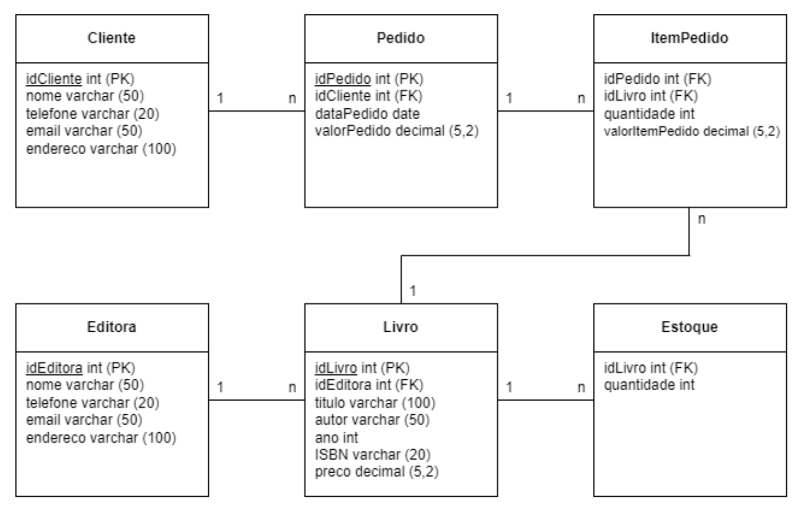

# Banco de dados | SQL

Trabalho para a disciplina Banco de Dados. 

O trabalho pede para considerar o seguinte Modelo Relacional (modelo lógico), referente ao estudo de caso de uma livraria:

  

Com base no Modelo Relacional e utilizando SQL, o objetivo é:

<ul>
  <li>Implementar as tabelas; <a href="https://github.com/rebecaparreiras/banco-de-dados/blob/main/questões/01-tabelas">(ver)</a></li>
  <li>Implementar uma consulta para listar o quantitativo de livros cadastrados, independentemente da editora; <a href="https://github.com/rebecaparreiras/banco-de-dados/blob/main/questões/02-qnt-livros.sql">(ver)</a></li>
  <li>Implementar uma consulta para listar os nomes dos clientes cadastrados em ordem crescente; <a href="https://github.com/rebecaparreiras/banco-de-dados/blob/main/questões/03-listar-clientes.sql">(ver)</a></li>
  <li>Implementar uma consulta para listar o nome de todas as editoras e os títulos de seus respectivos livros, em ordem decrescente; <a href="https://github.com/rebecaparreiras/banco-de-dados/blob/main/questões/04-listar-editoras.sql">(ver)</a></li>
  <li>Implementar uma consulta para listar o nome das editoras e a média de preço de seus livros utilizando 'group by'; <a href="https://github.com/rebecaparreiras/banco-de-dados/blob/main/questões/05-media-precos.sql">(ver)</a></li>
  <li>Implementar uma consulta para listar o nome de todos os clientes e quantidade de livros comprados utilizando 'group by'. <a href="https://github.com/rebecaparreiras/banco-de-dados/blob/main/questões/06-livros-comprados.sql">(ver)</a></li>
</ul>
